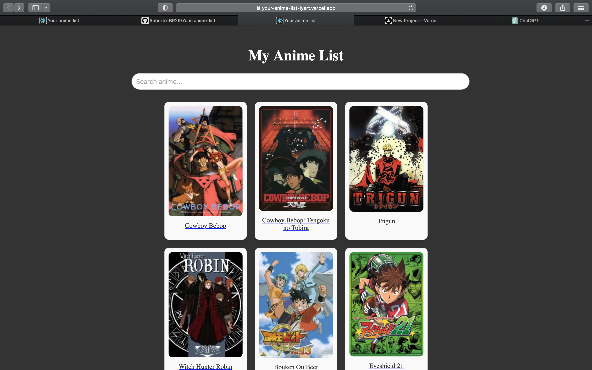
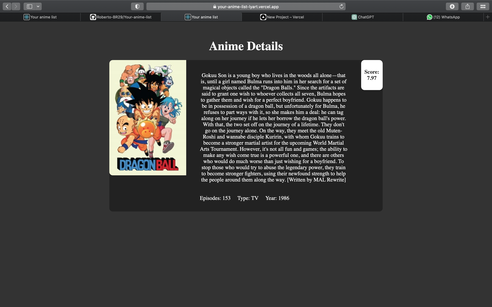

# Your Anime List

## Descrição
Your Anime List é uma aplicação web desenvolvida em React.js, que permite aos entusiastas de anime gerenciarem sua lista de anime assistidos, planejados e em andamento. Esta aplicação se integra à API Jikan, uma API não oficial que fornece informações abrangentes sobre animes, garantindo uma experiência rica e informativa aos usuários.

## Orientação de Utilização

### 1. Instalação de Dependências
- Certifique-se de ter o Node.js instalado em seu sistema.
- Clone o repositório do projeto usando o seguinte comando:

git clone https://github.com/Roberto-BR29/Your-anime-list

- Navegue até o diretório do projeto: 
cd anime

- Instale as dependências usando npm:
npm install

### 2. Executando a Aplicação
- Após a instalação das dependências, você pode iniciar a aplicação localmente usando o seguinte comando:
npm start

- Acesse a aplicação em seu navegador web digitando o seguinte URL: `http://localhost:3000`

### 3. Utilizando a Aplicação
- Após carregar a aplicação, você será apresentado à interface principal.
- Explore as diferentes seções para adicionar, editar e remover animes da sua lista.
- As informações sobre os animes são fornecidas em tempo real pela API Jikan, garantindo que você sempre tenha acesso às últimas informações.

## Tecnologias Utilizadas
- React.js
- HTML5
- CSS3
- JavaScript
- [API Jikan](https://jikan.moe/)

## Prints da Aplicação
- 
- 

## Acesso Online
Você pode acessar a aplicação online através deste [link](https://your-anime-list-lyart.vercel.app).

Para quaisquer dúvidas ou sugestões, sinta-se à vontade para entrar em contato com a equipe de desenvolvimento.
